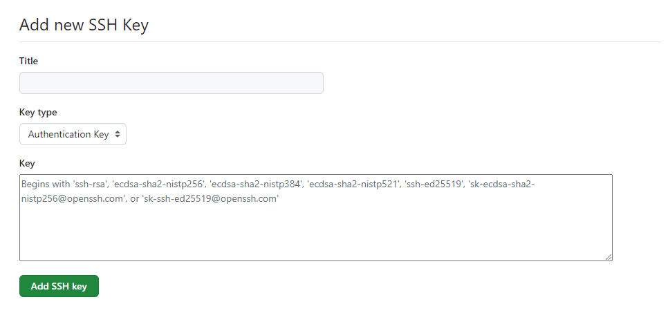

# Sprint 1 #

## Etape 1: Mise en place du serveur RHEL8
Code vagrant: https://github.com/delinel/Marry/tree/main/Vagrant/ionos

**Erreur rencontrée**
```
CentOS Stream 8 - AppStream                                                                                         0.0  B/s |   0  B     00:00    
Errors during downloading metadata for repository 'appstream':
  - Curl error (6): Couldn't resolve host name for http://mirrorlist.centos.org/?release=8-stream&arch=x86_64&repo=AppStream&infra=stock [Could not resolve host: mirrorlist.centos.org]
Error: Failed to download metadata for repo 'appstream': Cannot prepare internal mirrorlist: Curl error (6): Couldn't resolve host name for http://mirrorlist.centos.org/?release=8-stream&arch=x86_64&repo=AppStream&infra=stock [Could not resolve host: mirrorlist.centos.org]
```
**Solution**
```
sudo sed -i 's/mirrorlist/#mirrorlist/g' /etc/yum.repos.d/CentOS-*
sudo sed -i 's|#baseurl=http://mirror.centos.org|baseurl=http://vault.centos.org|g' /etc/yum.repos.d/CentOS-*
```

- Update packages and install basic tools
```
sudo yum update -y
sudo yum install epel-release -y
```

- Create the admin user to execute operations
```
ssh root@192.168.1.80
adduser -d /home/dely -s /bin/bash dely     #Create user
usermod -aG wheel dely                      #Add user to the root group
passwd dely                                 #Set password for user
```
- Permit user to user sudo before command without password
```
visudo
```
Add at the end of file
```
dely ALL=(ALL) NOPASSWD:ALL
```
- Exit terminal and reconnect with the new user
```
exit
ssh dely@192.168.1.80
```

**Personnalize the workspace**
- Edit the bashrc file
```
vi ~/.bashrc
```
- Add the variables
```
PS1='\[\033[00m\][\[\033[32m\]\u\[\033[36m\]@\[\033[33m\]\h\[\033[00m\]:\[\033[36m\]\w\[\033[00m\]]\[\033[00m\]\$' ==> prompt color
export HISTTIMEFORMAT="%F %T : " ==> horodatage of commands
```
```
source ~/.bashrc
```

**Generate the public and private keys**
- Edit the bashrc file
```
ssh-keygen -t rsa -b 4096
```

**Install java 17**
```
sudo yum install java-17-openjdk java-17-openjdk-devel
sudo yum groupinstall "Development Tools"
```
- Content of file /etc/profile.d/java.sh
```
export JAVA_HOME=/usr/lib/jvm/java-17-openjdk-17.0.6.0.9-0.3.ea.el8.x86_64
export PATH="$JAVA_HOME/bin:$PATH"
```
- Set java environment variables
```
sudo chmod +x /etc/profile.d/java.sh
source /etc/profile.d/java.sh
java -version
javac -version
```

**Install maven**
```
wget https://dlcdn.apache.org/maven/maven-3/3.9.6/binaries/apache-maven-3.9.6-bin.tar.gz
sudo tar xzf apache-maven-3.9.6-bin.tar.gz -C /opt
sudo mv /opt/apache-maven-3.9.6 /opt/maven
sudo vi /etc/profile.d/maven.sh
```
- Content of file /etc/profile.d/maven.sh
```
export M2_HOME=/opt/maven
export PATH=${M2_HOME}/bin:${PATH}
```

- Set maven environment variables
```
sudo chmod +x /etc/profile.d/maven.sh
source /etc/profile.d/maven.sh
mvn --version
```

**Install Docker**

```
sudo yum install -y yum-utils device-mapper-persistent-data lvm2 
sudo dnf config-manager --add-repo=https://download.docker.com/linux/centos/docker-ce.repo
sudo yum install docker-ce
sudo systemctl enable docker
sudo usermod -aG docker dely
```
- Set folder for the projects
```
sudo mkdir /projects    ## for the files code
sudo mkdir /docker      ## docker folder
sudo mkdir /logs        ## logs folder
sudo chown -R dely:dely /projects
```
- Set data-root for docker
 edit file **/etc/docker/daemon.json**
```
{
  "data-root": "/docker"
}
```
- Start docker service
```
sudo systemctl start docker
sudo systemctl status docker
docker --version
```

## Etape 2: Clone project through ssh and build artefact

- Copy the public key in github setting
```
cat ~/.ssh/id_rsa.pub
```
Github > Profile > Settings > SSH & GPG Keys > New SSH Key



- Clone the project
```
sudo yum install git
cd /projects
git clone git@github.com:delinel/frontend-devops.git
cd frontend-devops
```
- Build artefact
```
mvn clean package
```
- Run and test application
```
java -jar target/code-frontend-1.0.0-SNAPSHOT-runner.jar
curl localhost:8080 ## Nveau terminal
```

## Etape 3: Create docker image of application
- Connexion to the Hub docker
Connexion au registry docker-hub. Pour se connecter au registry docker nous alons creer un token de connexion avec les droits de lecture et ecriture a partir de la page suivante https://hub.docker.com/settings/security et nous alons l'utiliser comme mot de passe
```
docker login -u delinel
## password is token generated
```

- Creation du DockerFile pour l'appli (Dockerfile_codefrontend)
```
vi Dockerfile_codefrontend
```
https://github.com/delinel/frontend-devops/blob/develop/Dockerfile_codefrontend

- Build the image
```
docker build -t frontend-app:1.0.0 --build-arg VERSION=1.0.0 -f Dockerfile_codefrontend .
```
```
[dely@Ionos-sync:/projects/frontend-devops]$docker images
REPOSITORY     TAG       IMAGE ID       CREATED         SIZE
frontend-app   1.0.0     430329538b95   6 minutes ago   191MB
```
- Push the image to the private registry
```
docker tag frontend-app:1.0.0 delinel/devops:fronted-app-1.0.0
docker push delinel/devops:fronted-app-1.0.0
```

## Etape 4: Create docker-compose file
- Edit the compose
```
vi files/docker-compose_frontendapp.yml
```
https://github.com/delinel/frontend-devops/blob/develop/files/docker-compose_frontendapp.yml
- Run the container with docker compose in detach mode
```
docker compose -f files/docker-compose_frontendapp.yml up -d
docker ps -a
```
- Test application
```
sudo firewall-cmd --permanent --add-port=8080/tcp
sudo firewall-cmd --reload
#### ON external browser ######
curl http://192.168.1.80:8080
```

## Etape 5: Create nginx image file

- Create nginx image file (Dockerfile_nginxfrt)
```
vi files/Dockerfile_nginxfrt
```
https://github.com/delinel/frontend-devops/blob/develop/files/Dockerfile_nginxfrt

- Build the image
```
docker build -t nginx-frt:1.0.0 -f files/Dockerfile_nginxfrt .
```
- Push the image to the private registry
```
docker tag nginx-frt:1.0.0 delinel/devops:nginx-frt-1.0.0
docker push delinel/devops:nginx-frt-1.0.0
```

## Etape 6: Create docker-copose for nginx
**NB: Nginx is configure to make reverse-proxy of the frontend application**
- Edit the compose
```
vi files/docker-compose_nginxfrt.yml
```
https://github.com/delinel/frontend-devops/blob/develop/files/docker-compose_nginxfrt.yml

**NB: Before to run container, we are supposed create folder for volumes**
**config folder permit to have persistent volumes**
**Logs folder permit to save logs on host machine**
```
sudo mkdir -p /docker/volumes/nginx-frt/conf.d  ## Folder for our config files
sudo mkdir -p /docker/volumes/nginx-frt/logs    ## Logs folder
sudo vi /docker/volumes/nginx-frt/conf.d/quarkus_reverse.conf
sudo vi /docker/volumes/nginx-frt/conf.d/quarkus_lb.conf.disabled
sudo vi /docker/volumes/nginx-frt/conf.d/default.conf.disabled
```
- **quarkus_reverse.conf**: config file for reverse proxy
- **quarkus_lb.conf.disabled**: config file load balancing (disabled in this project)
- **default.conf.disabled**: nginx default file (disable in this project)
**two subnets were created to separate the frontend from the app**
  
- Run the nginx container
```
docker compose -f files/docker-compose_nginxfrt.yml up -d
docker ps -a
```

**Test of the reverse proxy**

```
sudo firewall-cmd --permanent --remove-port=8080/tcp
sudo firewall-cmd --permanent --add-port=80/tcp
sudo firewall-cmd --reload
#### ON external browser ###### 
curl http://192.168.1.80  #### Suppose to have access to the frontend-app through Nginx port
```
- Te two containers are running
```
CONTAINER ID   IMAGE                              COMMAND                  CREATED         STATUS         PORTS                                                                      NAMES
e6aadf91dc78   delinel/devops:nginx-frt-1.0.0     "/docker-entrypoint.…"   4 minutes ago   Up 3 minutes   0.0.0.0:80->80/tcp, :::80->80/tcp, 0.0.0.0:443->443/tcp, :::443->443/tcp   nginx-frt
d90c4b8e6ac7   delinel/devops:fronted-app-1.0.0   "java -jar code-fron…"   6 minutes ago   Up 6 minutes   0.0.0.0:8080->8080/tcp, :::8080->8080/tcp                                  quarkus_appli
```
