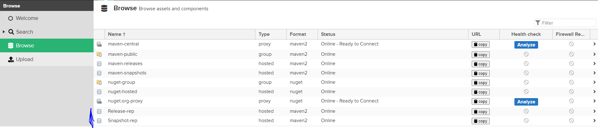

# Sprint2

## Etape 1: Add Nexus container

- Adding service account
```
sudo useradd --system --no-create-home nexus
```
- Creating necessory folder for Nexus (persistent volume)
```
sudo mkdir -p /nexus/data
sudo chown -R 200 /nexus/data
```
- Create compose file for nexus
```
cd /projects/frontend-devops
vi files/docker-compose_nexus.yml
```
- Run container through compose file
```
docker compose -f files/docker-compose_nexus.yml up -d
sudo firewall-cmd --permanent --add-port=8081/tcp
sudo firewall-cmd --reload
```

- Verify the volumes (persist data)
```
docker inspect nexus-app -f "{{ .Mounts }}"
```
**open nexus on browser http://192.168.1.80:8081**
- Authenticate with admin account, the default admin password is in the file **/nexus/data/admin.password**
- Create two repositories **Release** and **Snapshot**



## Etape 2: Add Jenkins container

- Adding service account jenkins
```
sudo adduser -d /home/jenkins -s /bin/bash jenkins
sudo usermod -aG wheel,docker jenkins
#### Add visudo #####
jenkins ALL=(ALL) NOPASSWD:ALL
```
- Check the groups of user
```
id jenkins
#### or #####
groups jenkins
```
- Creating necessory folder for jenkins (persistent volume)
```
sudo mkdir -p /jenkins/data
sudo chown -R jenkins:jenkins /jenkins
```
- Create Dockerfile for jenkins to customize uid and gid
```
vi files/Dockerfile_jenkins
cd files
```
- Build our jenkins image with specifics values ARG and push images to registry
```
docker build -t myjenkins:1.0.0 --build-arg USER_ID=1002 --build-arg GROUP_ID=1002 -f Dockerfile_jenkins .
docker tag myjenkins:1.0.0 delinel/devops:myjenkins-1.0.0
docker push delinel/devops:myjenkins-1.0.0
```
- Create compose file for jenkins
```
cd /projects/frontend-devops
vi files/docker-compose_jenkins.yml
```
- Run container through compose file
```
docker compose -f files/docker-compose_jenkins.yml up -d
sudo firewall-cmd --permanent --add-port=8084/tcp
sudo firewall-cmd --reload
```

- Verify the volumes (persist data)
```
docker inspect jenkins-app -f "{{ .Mounts }}"
```
**open nexus on browser http://192.168.1.80:8084 or http://192.168.1.80:8082/jenkins (if 404 Not found)**
- Authenticate with admin account, the default admin password is in the file **/jenkins/data/secrets/initialAdminPassword**